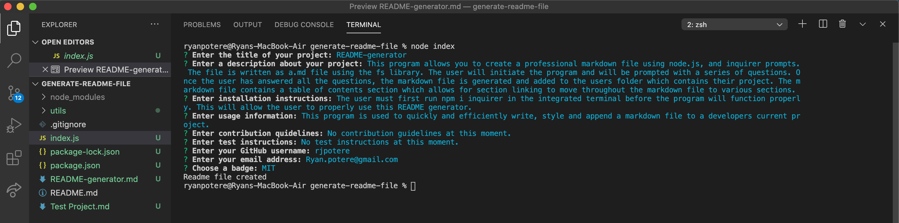

# README-Generator 

  ## **Table of Contents**
  1. [license](#license)
  2. [Description](#description)
  3. [Installation Instructions](#installation-instructions)
  4. [Usage information](#usage-information)
  5. [Contribution Guidelines](#contribution-guidelines)
  6. [Test Instructions](#test-instructions)
  7. [Questions?](#questions)

  ## **License:** 
 

  This application is covered under license type: MIT

  ## **Description:** 
 This program will allow the user to generate a markdown file by answering a series of prompts. Once the user answers the prompts, a markdown file is generated to include a table of contents which allows the user to navigate throught the markdown file using the table of conents. 

 

  ## **Installation Instructions:**
 To properly run this program, you must open the integrated terminal and run npm i inquirer. Once inquirer is installed you will be able to run this markdown generator. 

 

  ## **Usage Information:** 
The user will be able to efficiently write a README file by answer prompts that every README file should include. Once the questions are answered, the file is added to the users project. 

  ## **Contribution Guidelines:**
 No contribution guidelines at this time. 

  ## **Test Instructions:** 
No test instructions at this time.

  ## **Questions:**

  Github Profile: [rjpotere](https://github.com/rjpotere).

  Email me: [ryan.potere@gmail.com](mailto:ryan.potere@gmail.com)

